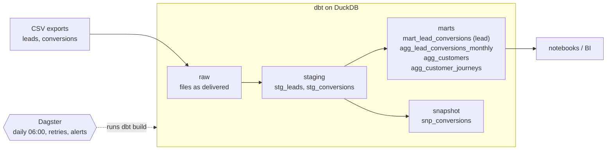

# Task 4 – Architecture & Automation

How the one-off work of Tasks 1–3 becomes a recurring pipeline. The code is illustrative, but the pipeline runs
from this repository as it is:
- **dbt** builds and tests the data ([`dbt/`](../dbt)).
- **Dagster** runs dbt every day, retries failed steps and reports failed runs
  ([`orchestration/definitions.py`](../orchestration/definitions.py)).
- A **Dockerfile** packages both into one image ([`orchestration/Dockerfile`](../orchestration/Dockerfile)).



## 1. Layer structure

| Layer | Purpose | Objects (grain) |
|---|---|---|
| raw | The exports exactly as delivered: every column as text, plus `_loaded_at`. Stands in for the ingestion job. | `raw.leads`, `raw.conversions` (file row) |
| staging | Cleaning only: trim, types, date formats, status spelling, exact duplicates. No joins, no business rules. | `stg_leads` (file row), `stg_conversions` (contract) |
| marts | Business tables, one stated grain each. Every KPI definition lives here, once: in the detail model (`mart_`) that the aggregated models (`agg_`) are built on. | `mart_lead_conversions` (lead), `agg_lead_conversions_monthly` (vertical × source × lead month), `agg_customers` (customer), `agg_customer_journeys` (customer journey) |
| snapshot | The history of every contract's status and premium (slowly changing dimension, type 2). | `snp_conversions` (contract version) |

## 2. Where the data-quality checks sit

Each check sits where a problem first becomes visible:

| Where | What it checks | Example |
|---|---|---|
| raw (source tests) | What the files deliver | every date has a known format; every premium parses |
| staging | Keys, accepted values, relationships | the status is active, cancelled or pending; a contract and its lead have the same e-mail |
| marts | The promises made to the business | one row per lead and per customer; one last touch per conversion; the aggregated models add up to the lead table and to all contracts |
| unit tests | The rules themselves, on fixed example rows | `06.10.2024` → 6 October; how duplicate leads are merged; which leads are touchpoints of a conversion |

**Severity**, in three levels:
- **Error:** every rule that must hold (keys, formats, accepted values, the reconciliation). The run fails at
  once.
- **Warn at the baseline, error above** (`warn_if` / `error_if`): the known issues from Task 1. They stay visible,
  and the run fails as soon as one of them grows.
- **Warn only:** two monitors for questions that only the team can answer (issues 4 and 5).

In Dagster, each dbt test appears as an asset check next to the model it tests.

**Each issue of Task 1 ([README](../README.md#task-1--data-profiling--data-quality)) and its check:**

| # | Issue | Check | Severity |
|---|---|---|---|
| 1 | Contracts without a valid lead | `stg_conversions.lead_id`: `not_null`, `relationships` to `stg_leads` | warn at 3 missing / 6 unknown ids, error above |
| 2 | Missing premium | `stg_conversions.premium`: `not_null`; unit test of the customer rule | warn at 2, error above |
| 3 | Duplicate lead ids | `stg_leads.lead_id`: `unique`; after the merge `mart_lead_conversions.lead_id`: `unique`; unit test of the merge rule | warn at 4, error above; error |
| 4 | Same name, two e-mail domains | `assert_name_has_one_email_domain` | warn |
| 5 | How a lead is linked to a contract | `assert_linked_lead_is_last_touch`; `assert_no_repeated_contract_in_window`; unit test of the attribution rule | warn at 1, error above; warn; error |
| 6 | Negative premiums | `stg_conversions.premium`: `accepted_range` (min 0) | warn at 2, error above |
| 7 | Dates in three formats | raw dates: `values_have_shape`; parsed dates: `not_null`; `mart_lead_conversions.days_to_sign` between 0 and the attribution window; unit test | error |
| 8 | Premium with decimal comma | raw premium: `parses_as_decimal`; unit test | error |
| 9 | E-mail formatting | unit test of trimming and lower-casing; `not_null` | error |
| 10 | Status spelling | `stg_conversions.status`: `accepted_values`; unit test | error |
| 11 | The latest leads can still convert | no test: `is_complete` marks the months and journeys that can still convert (covered by the unit test of the journeys) | – |
| 12 | Contract row exported twice | `stg_conversions.conversion_id`: `unique`; unit test | error |
| 13 | Missing vertical or region | `stg_leads.vertical`, `stg_leads.region`: `not_null`, `accepted_values` | warn at 3 and 5, error above |

The checks that passed in Task 1 are guarded too: `assert_conversion_email_matches_its_lead` fails as soon as a
contract and the lead it names belong to different people.

## 3. How often, and what happens on failure

**Daily at 06:00 (Vienna time)**, after the nightly export. This assumes the source exports once a day.
Marketing steers in days, not minutes, and the snapshot needs one run per day to catch status changes.

| Situation | What happens |
|---|---|
| A step fails (late export, locked file) | Dagster retries it twice, after 5 and 10 minutes. |
| A test with severity error fails | dbt skips everything downstream, so the marts keep yesterday's correct data instead of today's wrong data. |
| A known issue grows beyond its baseline | Its warning becomes an error, as above. |
| A known issue stays at its baseline | Warning only: the run finishes, and the warning stays visible in the run log and as an asset check. |
| The run still fails | A run-failure sensor reports it: here in the Dagster log, in production in the data team's Slack channel. |

## 4. Traceability and documentation

- **Lineage and run history:** Dagster shows every model with its dependencies, the checks of each run and the
  row count per table, so a sudden drop stands out. `dbt docs generate` shows the same lineage with all column
  descriptions.
- **Definitions next to the code:** every model and column is described in the dbt yml files, including its
  type and when it can be NULL. The notebooks and any BI tool read the marts, so there is one definition per KPI.
- **Data history:** `_loaded_at` records when a file was loaded. The snapshot keeps every status change with
  `dbt_valid_from` / `dbt_valid_to`, so a later run can tell when a contract was cancelled.
- **Code history:** every change goes through git. In a team, a pull request would run `dbt build` in CI before
  it is merged.

## 5. Example test

The shape check from Task 1 as a reusable dbt test
([`dbt/tests/generic/test_values_have_shape.sql`](../dbt/tests/generic/test_values_have_shape.sql)). A dbt
test fails when its query returns rows; here, every value whose shape is not in the list of known shapes.

```sql


with shaped as (
    select
        {{ column_name }} as value,
        {{ value_shape("trim(" ~ column_name ~ ")") }} as shape
    from {{ model }}
    where nullif(trim({{ column_name }}), '') is not null
)

select *
from shaped
where shape not in (
    '{{ shape }}', 
)


```

It's used on the raw date columns, with the known formats kept as a project variable:

```yaml
- name: created_at
  data_tests:
    - values_have_shape:
        arguments:
          shapes: "{{ var('date_formats_by_shape').keys() | list }}"
```

A new export format, e.g. `2024/05/12`, now fails the run before anything is built on it.

## 6. In production, e.g. on Google Cloud

The layers, tests and schedule stay the same. What changes is where things run:

| Part | Here | On Google Cloud |
|---|---|---|
| Landing | CSV files in `data/raw/` | The exports land in a Cloud Storage bucket, one folder per delivery. |
| Raw | An `on-run-start` hook copies the CSVs into DuckDB | A Dagster sensor notices a new delivery and loads it into the BigQuery dataset `raw` (all columns as STRING, plus `_loaded_at`). Source freshness checks warn when a delivery is late. |
| Warehouse | DuckDB file, dbt-duckdb | BigQuery with dbt-bigquery, with separate datasets for dev, CI and prod. The few DuckDB functions in the models (e.g. `try_strptime`, `count(*) filter`, `::` casts) move into macros with a BigQuery variant (`adapter.dispatch`). |
| Orchestration | `dagster dev` in one container | The Dagster webserver and daemon on GKE (Helm chart), each run in its own pod, with the run history in Cloud SQL (Postgres). Images in Artifact Registry. |
| Access | – | One service account per environment (Workload Identity) that can write only its own datasets; no keys in the image. |
| Alerts | Error in the Dagster log | The failure sensor posts to Slack; Cloud Monitoring watches the deployment. |
| CI | – | Every pull request builds the changed models and everything downstream in a CI dataset (`dbt build --select state:modified+`). |

- **Why dbt and not Dataform:** dbt runs locally without a cloud account, and the same project moves to BigQuery.
  Dataform would be the GCP-native alternative, with the same layers and assertions.
- **A lighter setup:** without the need for lineage and a UI, a Cloud Run job that runs `dbt build`, started by
  Cloud Scheduler, is the smallest setup. Dagster pays off once there are several sources and consumers.
