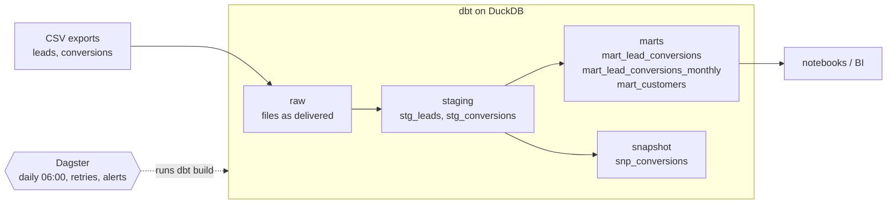

# Task 4 – Architecture & Automation

The one-off work of Tasks 1–3 runs as a recurring pipeline:
- **dbt** builds and tests the data.
- **Dagster** runs dbt on a schedule, retries failed steps and reports failures.
- One **Docker** image holds both (`orchestration/Dockerfile`, `orchestration/definitions.py`).



## 1. Layers

| Layer | Purpose | Objects |
|---|---|---|
| raw | The exports exactly as delivered: every column as text, plus `_loaded_at`. Stands in for the ingestion job. | `raw.leads`, `raw.conversions` |
| staging | Cleaning only, one row per source row: trim, types, date formats, status spelling, exact duplicates. | `stg_leads`, `stg_conversions` |
| snapshot | History of every contract's status and premium (slowly changing dimension, type 2). | `snp_conversions` |
| marts | Business tables, each with a stated grain. | `mart_lead_conversions` (lead), `mart_lead_conversions_monthly` (vertical × channel × lead month), `mart_customers` (customer) |

## 2. Where the data-quality checks sit

Each check sits where a problem first becomes visible:

| Where | What it checks | Example |
|---|---|---|
| raw (source tests) | What the files deliver | every date has a known format; every premium parses |
| staging | Keys, accepted values, relationships | the status is active, cancelled or pending |
| marts | The promises made to the business | one row per lead; the Task 3 marts add up to the lead mart and to all contracts |
| unit tests | The rules themselves, on fixed example rows | `06.10.2024` → 6 October; how duplicate leads are merged |

**Severity:**
- Known issues from Task 1 warn at their baseline and fail the run when they grow (`warn_if` / `error_if`). Example: the 6 unknown lead ids.
- Every other test fails the run at once.
- In Dagster, each dbt test appears as an asset check next to the model it tests.

## 3. How often, and what happens on failure

- **Daily at 06:00 (Vienna time)**, after the nightly export. This assumes the source exports once a day. Marketing steers in days, not minutes, and the snapshot needs one run per day to catch status changes.
- **A test with severity error fails:** dbt skips everything downstream, so the marts keep yesterday's correct data instead of today's wrong data.
- **A step fails:** Dagster retries it twice, after 5 and 10 minutes. That covers a late export or a locked file.
- **Still failing:** a run-failure sensor reports the run. In the example it writes an error to the Dagster log; in production it would post to the data team's Slack channel or send an e-mail.
- **Warnings** don't stop the run, but they stay visible in the run log and as asset checks.

## 4. Traceability and documentation

- **Lineage and run history:** Dagster shows every model with its dependencies, the checks of each run and the row count per table, so a sudden drop stands out. `dbt docs generate` shows the same lineage with all column descriptions.
- **Definitions next to the code:** every model and column is described in the dbt yml files, including its type and when it can be NULL.
- **Data history:** `_loaded_at` records when a file was loaded. The snapshot keeps every status change with `dbt_valid_from` / `dbt_valid_to`.
- **Code history:** every change goes through git. In a team, a pull request would run `dbt build` in CI before it is merged.

## 5. Example test

The shape check from Task 1 as a reusable dbt test (`dbt/tests/generic/test_values_have_shape.sql`). A dbt test fails
when its query returns rows; here, every value whose shape is not in the list of known shapes.

```sql


with shaped as (
    select
        {{ column_name }} as value,
        {{ value_shape("trim(" ~ column_name ~ ")") }} as shape
    from {{ model }}
    where nullif(trim({{ column_name }}), '') is not null
)

select *
from shaped
where shape not in (
    '{{ shape }}', 
)


```

It's used on the raw date columns, with the known formats kept as a project variable:

```yaml
- name: created_at
  data_tests:
    - values_have_shape:
        arguments:
          shapes: "{{ var('date_formats_by_shape').keys() | list }}"
```

A new export format, e.g. `2024/05/12`, now fails the run before anything is built on it.

## 6. Run it

```bash
docker build -f orchestration/Dockerfile -t lead-conversions .
docker run -p 3000:3000 lead-conversions
```

Open http://localhost:3000 and materialize the assets, or let the schedule run. Without Docker, from an activated
venv: `dagster dev -m orchestration.definitions`.

## 7. What changes in production

- **Warehouse:** DuckDB becomes e.g. BigQuery; only the dbt profile changes.
- **Dagster:** the web server and the daemon run as separate services, the run history lives in Postgres, and alerts go
  through Slack.
- **Ingestion:** instead of the on-run-start hook, a real load job, or a Dagster sensor that starts the run when new
  files arrive. Source freshness checks then watch the arrival time.
- **CI:** `dbt build` on every pull request, limited to the changed models (`--select state:modified+`).
